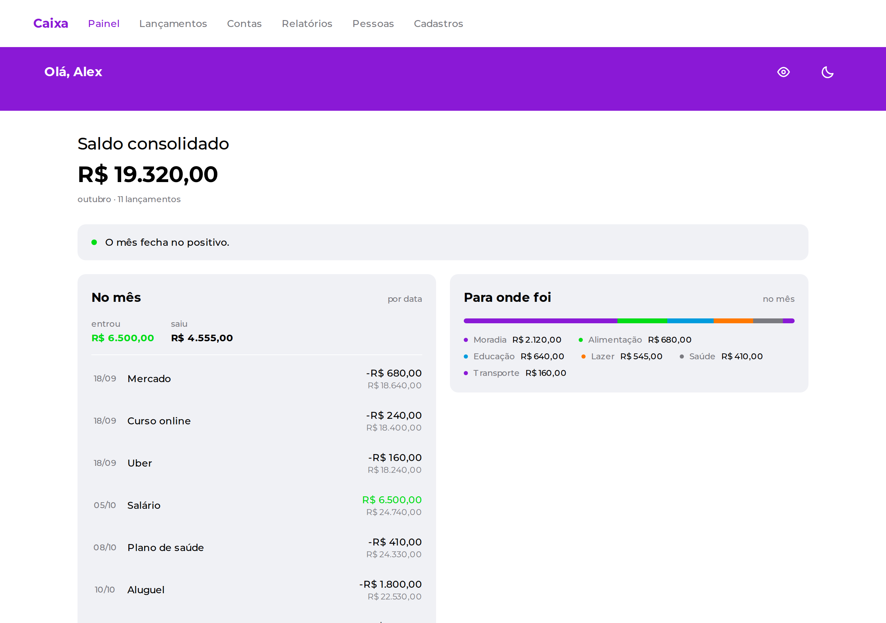
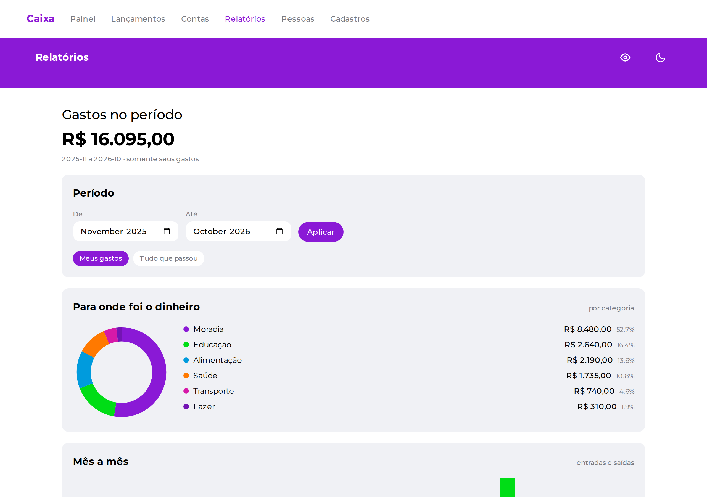
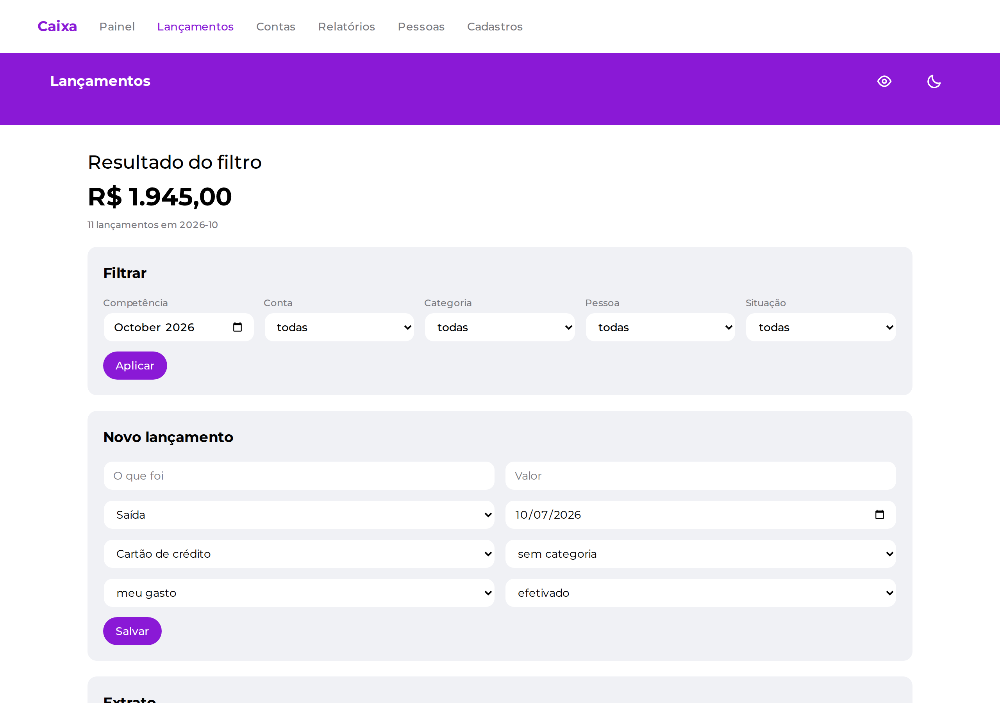
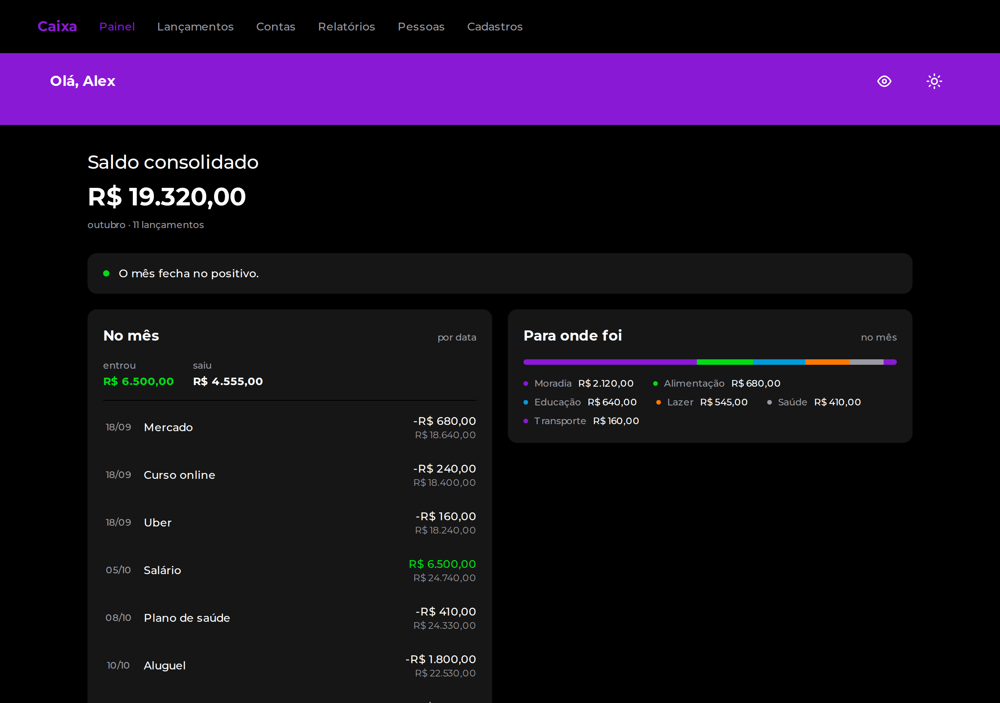
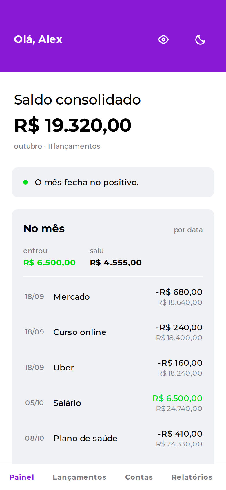

# Caixa

Controle financeiro pessoal self-hosted. Você sobe a sua instância, seus dados
ficam no seu banco, e ninguém mais tem acesso a eles.



## O que ele responde

Não é uma lista de recursos — são as perguntas que o sistema existe para
responder:

- **O mês fecha?** Quanto entra, quanto sai, **em que dia** — e se o saldo fica
  negativo antes do vencimento da fatura
- **Para onde foi o dinheiro?** Gastos por categoria, mês a mês, com a evolução
  do saldo separando o que já aconteceu do que é projeção
- **Quem me deve quanto?** Quando outras pessoas usam seus cartões, quanto da
  fatura é gasto seu e quanto volta como reembolso
- **Quanto custa rolar a dívida?** Antecipações registram o que foi contratado e
  o que foi recebido; a taxa é derivada, e o custo acumulado fica visível

## Como rodar

### Experimentar em um comando

Requer apenas Docker. Sobe banco e aplicação, aplica o schema e carrega dados
de demonstração:

```bash
docker compose -f docker-compose.demo.yml up
```

Abra http://localhost:3000. Leva cerca de um minuto na primeira vez.

### Desenvolvimento

Requer Node 22+ e Docker.

```bash
cp .env.example .env
npm install
npm run db:up
npm run db:push
npm run db:seed    # dados de demonstração, opcional
npm run dev
```

| Comando | O que faz |
|---|---|
| `npm run dev` | Servidor de desenvolvimento |
| `npm test` | Suíte de testes |
| `npm run db:up` / `db:down` | Sobe / derruba o Postgres |
| `npm run db:seed` | Popula com um perfil fictício coerente |
| `npm run db:studio` | Interface web do banco |

## Telas

| Relatórios | Lançamentos |
|---|---|
|  |  |

Modo escuro e layout de celular:

| Painel escuro | Painel no celular |
|---|---|
|  |  |

As capturas são geradas a partir do seed de demonstração:

```bash
docker compose -f docker-compose.demo.yml up -d
npx tsx scripts/capturar.ts
```

## Como é por dentro

```
src/
  domain/    regras puras — sem Prisma, sem React, testadas em milissegundos
  server/    Prisma e casos de uso
  app/       telas (Next.js App Router)
```

A camada `domain/` não importa Prisma nem React. Se um teste dela precisar de
banco ou browser, a regra está na camada errada.

**Stack:** Next.js 16, React 19, TypeScript, Prisma 7, Postgres, Tailwind 4,
Vitest.

## Decisões que não são óbvias

**Uma tabela de lançamentos, não quatro.** Receita, conta fixa, parcela e
pagamento são todos "dinheiro que entra ou sai numa data". Separá-los em tabelas
faz `gastos por categoria` virar quatro consultas e uma mesclagem em memória, e
cada tipo novo tocar todo relatório já escrito. Unificados, a mesma pergunta é um
`GROUP BY`. Parcelamento e recorrência existem como **geradores** de lançamentos,
não como tipos.

**Dinheiro é inteiro em centavos.** `0.1 + 0.2` em JavaScript dá
`0.30000000000000004`. Nenhum float circula pelo sistema; a conversão acontece
uma vez, na borda de entrada.

**Datas são strings `YYYY-MM-DD`, nunca `Date`.** `new Date('2026-08-15')` é
meia-noite UTC e, lido em `America/Sao_Paulo`, vira dia 14 — deslocando uma
compra para a fatura errada. A aritmética é feita sobre os componentes.

**Saldo é derivado, não armazenado.** Saldo inicial mais lançamentos efetivados.
Um número gravado desatualiza assim que alguém corrige um lançamento antigo, e
não há como saber que ele mentiu.

**Status nunca é inferido da data.** Uma fatura vencida não é uma fatura paga —
pode ser exatamente a que está em atraso. Os estados são `previsto`, `efetivado`
e `em aberto`, e registram o que aconteceu, não o que deveria ter acontecido.

**Transferência entre contas próprias não é despesa.** Ela vira um par de
lançamentos ligados e sai dos relatórios de gasto. Incluí-la inflaria todo
relatório sem que ninguém percebesse de onde veio.

**Parcelas somam exatamente o total.** R$ 100 em 3× vira 33,34 + 33,33 + 33,33,
com o resto na primeira. Dividir e arredondar perderia centavos a cada compra.

**Gráficos em SVG, sem biblioteca.** Rosca, barras e linha somam poucas dezenas
de linhas cada; bibliotecas do ramo pesam centenas de kilobytes para dar
flexibilidade que três gráficos fixos não usam.

## Design

A identidade visual foi replicada, como exercício de implementação, a partir de
arquivos públicos da comunidade no Figma:

- [projeto tela nubank (Community)](https://www.figma.com/design/Mwc5gzmCdaMn7TNoCpPyBM/projeto-tela-nubank--Community-)
- [Nubank web (Community)](https://www.figma.com/design/FqwVdlyUZ3It7aOKNzSMaq/Nubank-web--Community-)

Nenhuma marca registrada é usada: não há logo nem nome de instituição financeira
na aplicação.

## Estado

Núcleo e relatórios completos. Importação de OFX/CSV, orçamento por categoria com
limite e metas de economia ainda não existem.

## Licença

MIT — veja [LICENSE](LICENSE).
